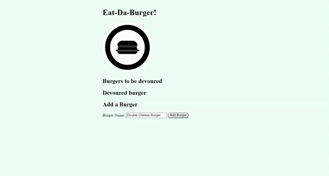

# Burger App

## Table of Contents

- [Description](#Description)
- [Screen Shots](#Screen-Shots)
- [Technology Used](#Technology-Used)
- [License](#license)

## Deployed Site
 [Click Here ](https://fierce-bayou-39464.herokuapp.com/)

## Description

This app is a CRUD app that uses MYSQL. The user can enter burger that they want  to eat and it will be added to the list of burgers that are ready to be eaten. Once the devoured button is clicked the burger will move to devoured section. The user also has to the option to delete burger.  


## Screen-Shots


## Technology-Used
```
HTML
CSS / BOOTSTRAP
Javascript
MYSQL
Handlebars
MVC
Heroku
```
## License

[](https://opensource.org/licenses/MIT)

## Question

If you have any questions please feel free to contact me.\
**Email:** zakfena@gmail.com\
**Git Hub** https://github.com/ZAKFENA

